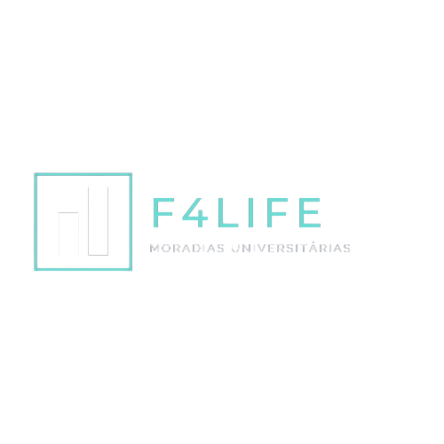

<h1 align="center">Projeto F4Life</h1>
<h3 align="center">Site de busca de moradias em imóveis desenvolvidos para compartilhamento.<h3>

   

 <a href="#objetivo">Objetivo</a> •
 <a href="#roadmap">Roadmap</a> • 
 <a href="#tecnologias">Tecnologias</a> • 
 <a href="#contribuicao">Contribuições</a> 

<h3>Objetivo do projeto</h3>

O objetivo deste primeiro trabalho em grupo era exercitar os nossos aprendizados do último mês nas linguagens de HTML, CSS e JS, bem como exercitar nossas habilidades em soft skills trabalhando em grupo no desenvolvimento do projeto que tinha como temática diversas opções para escolha.

<h3>Roadmap</h3>

Partimos da votação da temática do projeto, a Kahena votou na F4Life pelas experiências profissionais anteriores terem sido justamente nessa proposta, e seguimos como referência o site de uma empresa que ela inclusive prestou serviço, a <a href="https://www.yuca.live/" target="_blank">Yuca</a>. Chegamos no resultado possível para se realizar no prazo esperado de dois dias, e foi bacana seguir um design criativo que nos agradou e nos permitiu focar nos códigos.

<h3>Tecnologias</h3>

Utilizamos principalmente o HTML e o CSS, nos esforçando para colocar em prática o que aprendemos no avançado, o JS foi necessário apenas para o menu responsivo mobile.

<h3>Contribuições</h3>

Trabalhamos em dupla, dividindo o projeto em duas partes:

A Kahena foi responsável pela tela inicial, que contém a home, sobre, vantagens e contato. Determinando assim o estilo do site, fonts, background, header e footer, utilizado também na segunda tela.

A segunda tela, de busca, foi finalizada pela Mayra, que contém alguns imóveis disponíveis na plataforma para locação.

Estamos ansiosas pela avaliação da equipe de QA da Labenu!

 

Quer ver o resultado do nosso trabalho? <a href="https://giant-sky.surge.sh/" target="_blank">Clique aqui</a>.

“A única habilidade competitiva de longo prazo é a capacidade de aprender.”

